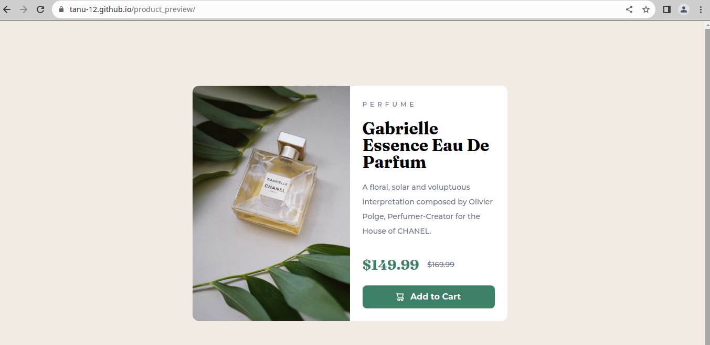

# Frontend Mentor - Product preview card component solution

This is a solution to the [Product preview card component challenge on Frontend Mentor](https://www.frontendmentor.io/challenges/product-preview-card-component-GO7UmttRfa). Frontend Mentor challenges help you improve your coding skills by building realistic projects. 

## Table of contents

- [Overview](#overview)
  - [The challenge](#the-challenge)
  - [Screenshot](#screenshot)
  - [Links](#links)
- [My process](#my-process)
  - [Built with](#built-with)
  - [What I learned](#what-i-learned)
  - [Continued development](#continued-development)
  - [Useful resources](#useful-resources)
- [Author](#author)
- [Acknowledgments](#acknowledgments)

**Note: Delete this note and update the table of contents based on what sections you keep.**

## Overview
Frontend mentor challenges mainly consist of objectives that requires you to replicate a given webpage . This challenge is also same. Here a single page is to be designed that have a product card . The card have the below information.
1. Product name
2. Product image
3. Product price
4. Product description
5. Option to add to cart
### The challenge
I wanted to approach this project in a different way .
In the past I have just focus on the fact that my project needs to work and that'll be enough 
But overtime i have realized that this approach of making things just work won't take me anywhere 

I wanted some guidance from someone who is experienced.
I took help from kevin powell tutorial on youtube . He is a great teacher.

This project might not be my original creation but it have paved a way for me on how to
approach project and make them readable as well as optimal


### Screenshot




### Links

- Solution URL: (https://github.com/tanu-12/product_preview)
- Live Site URL: (https://tanu-12.github.io/product_preview/)

## My process

I approached it using mobile version first 


Here is the step by step process

1. I first studied the design and compare my html with it and added tags which I could understand from design
2. Css
  1. I started css . Started with reset of css and used josh css reset (link provided below )
  CSS helps provide a clean slate to start with. Properties like margin and font can cause problem 
  2. Added utility class . Here there is only one that describe flex-group
  3. Added general styling to give structure . General styling consisted of styling body, card , product content,
  4. Now for specific styling . Specific styling was required for button, price, product image
  5. Button had a flex layout consist of two items shopping cart icon and the text add to card . As for shopping cart icon
  used data attributes because this card may require other icons like user icon, price icon
  6. Price also had a flex layout but here both item required different styling . it also required accessibility because the 
  original price that was crossed off might create difficulty to people who use screen reader
  7.product image could have simple if the image remain constant but actually the here two image are used one is desktop and other for mobile hence picture element was used 
3. Now for its responsive layout i used a min width of 600 px . when the page is expanded beyond 600px it changes its layout and 
become two column grid which was previously a 1 column grid 


### Built with

- Semantic HTML5 markup
- CSS custom properties
- CSS Variables
- Flexbox
- CSS Grid
- Mobile-first workflow


**Note: These are just examples. Delete this note and replace the list above with your own choices**

### What I learned

Use this section to recap over some of your major learnings while working through this project. Writing these out and providing code samples of areas you want to highlight is a great way to reinforce your own knowledge.

To see how you can add code snippets, see below:

```html
<h1>Some HTML code I'm proud of</h1>
```
```css
.proud-of-this-css {
  color: papayawhip;
}
```
```js
const proudOfThisFunc = () => {
  console.log('🎉')
}
```

If you want more help with writing markdown, we'd recommend checking out [The Markdown Guide](https://www.markdownguide.org/) to learn more.

**Note: Delete this note and the content within this section and replace with your own learnings.**

### Continued development

Use this section to outline areas that you want to continue focusing on in future projects. These could be concepts you're still not completely comfortable with or techniques you found useful that you want to refine and perfect.

**Note: Delete this note and the content within this section and replace with your own plans for continued development.**

### Useful resources

- [CSS Reset](https://www.joshwcomeau.com/css/custom-css-reset/) - This helped me in resetting csss. 


- [Data Attribute](https://css-tricks.com/a-complete-guide-to-data-attributes/) - This helped me in understanding data attributes 

- [Tutorial](https://www.youtube.com/watch?v=B2WL6KkqhLQ)-- Kevin powell helped in how to approach a project and have a clear aim.


## Acknowledgments

This is where you can give a hat tip to anyone who helped you out on this project. Perhaps you worked in a team or got some inspiration from someone else's solution. This is the perfect place to give them some credit.

**Note: Delete this note and edit this section's content as necessary. If you completed this challenge by yourself, feel free to delete this section entirely.**
